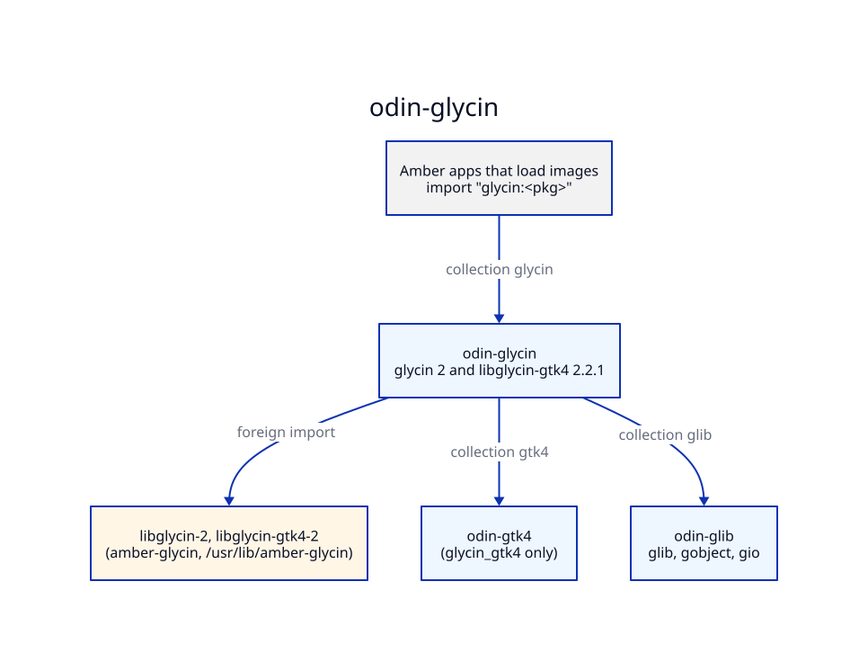

# Architecture — odin-glycin

## Generation

`make generate` runs `scripts/generate.sh`: for each package, runic over its `rune.yml`, then
`scripts/postprocess.sh <pkg>`. The headers are amber-glycin's staged
`usr/include/glycin-2` and `glycin-gtk4-2`; the GTK headers libglycin-gtk4 includes are
amber-gtk4's staged `usr/include/gtk-4.0`. The script links them under `build/` (`build/glycin`,
`build/gtk4`, `build/sys` to `/`) because runic matches `extern` globs against paths relative to
the rune file. The output is committed, so consumers need neither runic nor the headers to build.

Dependency types stay external. `glycin` takes GLib, GObject and GIO from the `glib:` collection;
`glycin_gtk4` takes `GlyFrame` from `glycin:glycin` and `GdkTexture` from `gtk4:gtk4`. Regeneration
is deterministic: running `make generate` twice gives identical files.

## Patches

Where runic gets a signature wrong, the fix is a rule in `scripts/postprocess.sh`, listed in
[PATCHED.md](PATCHED.md), and pinned in `<pkg>/patched.odin` by a typed variable. A regeneration
that drops a patch then fails to compile. The one flag enum becomes a `bit_set` by an explicit list
([DECISIONS.md](DECISIONS.md) §2).

## Collections

The collection `glycin` points at this repo's root. Packages import their siblings and the
bindings below them through collections, never by relative path.

## Tests

Each package has a `_test.odin` with `#+test`. The tests run the real sandboxed loaders, so the
Makefile (`make test`):

1. checks that amber-glycin's and amber-gtk4's stages exist, and stops with the build command if not;
2. runs `scripts/data-dir.sh`, which copies the staged loader configs to `build/glycin-data` with
   `Exec=` rewritten from `/usr/lib/amber-glycin` to the stage;
3. links with `-L` and a RUNPATH to the stage and sets `GLYCIN_DATA_DIR` to that copy;
4. runs `glycin` plainly and `glycin_gtk4` under `xvfb-run -a env -u WAYLAND_DISPLAY`, one test
   thread (the async tests iterate the default main context).

`fixtures/` holds the small images the tests decode, made by `scripts/fixtures.sh` and committed;
`scripts/big-fixture.sh` writes the 8.6 GB-decoded PNG that `make test-big` uses into `build/`.
Hostile fixtures (truncated, damaged, a header claiming 65535 x 65535 pixels, unknown bytes, an
empty file) and a fixed set of mutated PNG and JPEG inputs check that the loader fails and the test
process carries on.

The examples (`examples/info`, `examples/view`) are built by `make check`.
